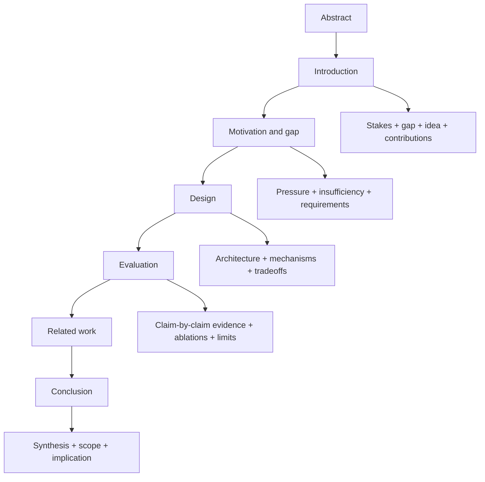

# References — Index and Venue Table

> Index for the `writing-systems-papers` skill. Companion to `../SKILL.md`.
>
> **Author agent**: read `whole-paper.md` first, then the file matching the section you are drafting. Apply each file's §1–5 while writing.
>
> **Reviewer agent (auto-review-loop)**: load `whole-paper.md` plus every section file. Apply each §6 Reviewer Rubric. Emit each file's §7 YAML output. The round score aggregates section-level YAML and the whole-paper X-rubric.

## Files

| File                  | Purpose                                                                    |
| --------------------- | -------------------------------------------------------------------------- |
| `whole-paper.md`      | Universal hard bans + paragraph discipline + X-rubric + gestalt            |
| `typography.md`       | LaTeX overflow / table fit / equation breaking / identifier wrapping       |
| `abstract.md`         | Abstract: 5 components, prose discipline, hard bans, rubric                |
| `introduction.md`     | §1: stakes / gap / idea / contributions, rubric                            |
| `motivation.md`       | §2: pressure / insufficiency / requirements, rubric                        |
| `design.md`           | §3: goals / mechanisms / tradeoffs / assumptions, rubric                   |
| `implementation.md`   | §4: language / scale / engineering choices / artifact, rubric              |
| `evaluation.md`       | §5: claim matrix / setup / baselines / ablations / limits, rubric          |
| `related-work.md`     | §6: clustering / contrast / novelty, rubric                                |
| `conclusion.md`       | §7: synthesis / scope / implication, rubric                                |
| `sources.md`          | Canonical URLs for CFPs, writing guides, exemplar papers                   |

## Section role map

| Section      | Job                                                              | Reviewer's silent question                                    |
| ------------ | ---------------------------------------------------------------- | ------------------------------------------------------------- |
| Abstract     | The whole paper in miniature, transmittable in one read          | Why should I assign or read this paper at all?                |
| Introduction | An area problem turned into *this* paper's falsifiable claim     | Important, hard, in scope, plausibly solved?                  |
| Motivation   | Status-quo failure made concrete                                 | Why doesn't an incremental tweak to prior work solve this?    |
| Design       | The technical choices made to look inevitable                    | Principled, implementable, better-motivated than alternatives? |
| Evaluation   | Claims converted into evidence                                   | Did the experiments actually test the claims?                 |
| Related work | Novelty made legible and fair                                    | Do the authors know the literature and contrast honestly?     |
| Conclusion   | Memory and scope                                                 | What should I remember; where does the result stop?           |

## Default paper logic

## Venue table

Verify against the current CFP before submitting. Policies change yearly.

| Venue   | Body cap                                  | Appendix policy                                              | Section-relevant rules                                                                          |
| ------- | ----------------------------------------- | ------------------------------------------------------------ | ----------------------------------------------------------------------------------------------- |
| OSDI    | 12 pages + references                     | Main body must stand alone; no padding; abstract must be meaningful (placeholder text desk-rejected) | Judged on novelty, significance, interest, clarity, relevance, correctness                      |
| NSDI    | 12 pages + references + supp. appendix    | Reviewers may ignore supplementary; body claims must stand alone | Design principles, implementation, practical evaluation                                         |
| SOSP    | 12 pages + references                     | Body must stand alone                                        | Significant systems contribution                                                                |
| ASPLOS  | 11 pages + references; camera-ready 13    | Body must stand alone                                        | Architecture / programming / OS integration                                                     |
| EuroSys | 12 pages + references                     | Body must stand alone                                        | Systems contribution                                                                            |
| MLSys   | 10 pages + references + optional appendix | Reviewers not required to read appendix                      | Novelty, quality, interest, impact; reproducibility encouraged                                  |
| SIGCOMM | 12 pages + references + optional appendix | Body claims cannot depend on appendix                        | **Abstract hard cap 200 words**; ethics statement in body; `.bbl` validated for hallucinations  |
| MobiCom | 12 pages + references + optional appendix | Body must stand alone                                        | Abstract registration must be meaningful (≥100 words); limitations explicitly valued            |

## Venue-specific overrides for the abstract word cap

| Venue              | Abstract hard cap (words) | Notes                                              |
| ------------------ | ------------------------- | -------------------------------------------------- |
| OSDI / NSDI / SOSP | 220                       | 180 target                                         |
| ASPLOS / EuroSys   | 220                       | 180 target                                         |
| MLSys              | 220                       | 180 target                                         |
| SIGCOMM            | 200                       | Hard cap from the CFP                              |
| MobiCom            | 220, lower bound 100      | Registration text must be ≥100 words and meaningful |

## Rubric priority order

When two rubric items conflict, resolve in this priority:

1. **Whole-paper hard bans** (U1–U6 in `whole-paper.md` and `../SKILL.md`)
2. **Section-level hard bans** (BAN rows in each section file's §6 rubric)
3. **Cross-section X-rubric** (X1–Xn in `whole-paper.md`)
4. **Section-level required components** (COMP rows)
5. **Section-level discipline rules** (DISC rows)
6. **Section-level gestalt rubric** (GEST rows)

A BAN trigger forces FAIL even if all COMP and DISC rows pass.
